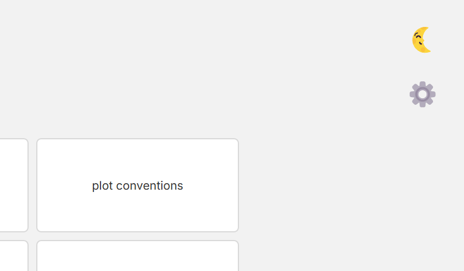
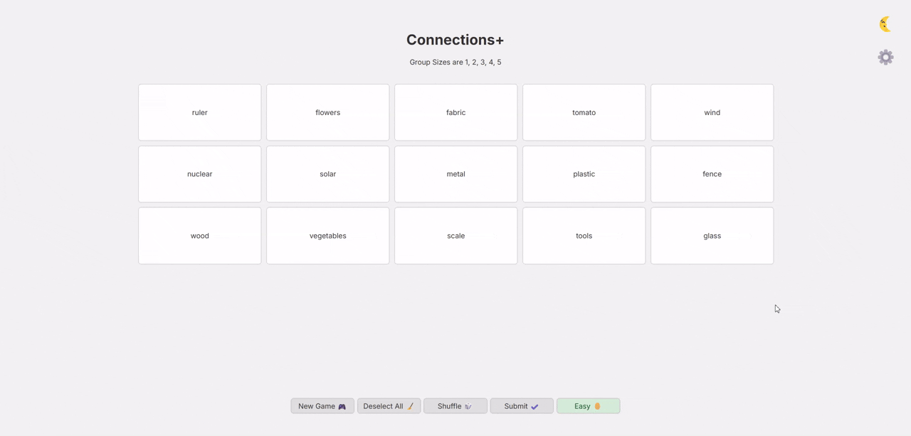

# Connectons+

<p align="center">
  
</p>

<p align="center">
  A remix of The New York Times' <a href="https://www.nytimes.com/games/connections">Connections</a> — but with a twist ✨  
  <br>
  <b>Connectons+</b> lets you tackle word <i>groups of different sizes</i> for an extra dose of challenge and variety 😄
</p>

<p align="center">
  
  
  
  
  
  
  
</p>

## Overview

Connectons+ reimagines the classic Connections puzzle with a more unpredictable format. Instead of four tidy groups of four, this version gives you word clusters of all shapes and sizes.

The game features multiple difficulty levels, customizable UI settings, and intuitive controls.

## How to Play

### Objective
Group the words by their hidden connections. Each word fits into one—and only one—group. The catch? You don’t know how many words are in each group. 😉

### Gameplay

1. Click on the words you think belong together.
2. Hit **Submit** to check your guess.
3. Keep going until all groups are found.

### Controls

- Click a tile to **select** or unselect it.
- Use **Submit** to check your current group.
- **Deselect All** clears your selection.
- **Shuffle** mixes up the tiles.
- **New Game** starts over with a new puzzle.
- **Difficulty Toggle** switches between Easy, Medium, and Hard modes.

### Feedback System

To help (but not spoil):

- ✅ **Correct selections:** You'll get praised and the tile will move to the solution area with their connection revealed.
- ℹ️ **Partially correct submissions (more than half right):** Reveal how many tiles are correct.
- ❌ **Mostly incorrect:** You'll get a generic "nope" message.
- 🔄 **Repeated submissions:** The game will nudge you to try something new.


## Game Features

- **Variable group sizes** for increased challenge (and fun) compared to the original game 🚀
- **Multiple difficulty levels** 🐤
- **Customizable interface** with theme and layout options 🌗
- **Responsive design** that works on desktop and mobile devices 📱
- **Confetti showers** when you win 🎊
- **Cloud-based puzzle storage using Supabase** ☁️

## Live Demo

You can play it right here:  
👉  [https://connections-plus.vercel.app/](https://connections-plus.vercel.app/)

## Installation & Setup

### Prerequisites
- [Node.js](https://nodejs.org/) (v14 or higher)
- npm (comes with Node)
- [Supabase](https://supabase.com/) account (for database features)
- [Python 3.8](https://www.python.org/) (or higher)

### Local Development

1. **Clone the repository**
   ```bash
   git clone https://github.com/guychuk/connections_plus.git
   cd connections_plus
   ```

2. **Set up a Python virtual environment (for the DB scripts)**
   - Create a virtual environment:
     ```bash
     python -m venv venv
     ```
   - Activate the virtual environment:
     - On Windows:
       ```bash
       venv\Scripts\activate
       ```
     - On macOS/Linux:
       ```bash
       source venv/bin/activate
       ```

3. **Install Python dependencies**
   ```bash
   pip install -r requirements.txt
   ```

4. **Install Node.js dependencies**
   ```bash
   npm install
   ```

5. **Configure Supabase**
   - Create an account at [Supabase](https://supabase.com/) and start a new project.
   - Create the necessary tables, edge functions, and RLS (find them in `/data`).
   - In the project settings, grab your Project URL and anon public key.
   - Create a `.env` file in the root directory.
   - Add your Supabase URL and anon key:
     ```
     VITE_SUPABASE_URL=your_supabase_url
     VITE_SUPABASE_ANON_KEY=your_supabase_anon_key
     ```

6. **Start the development server**
   ```bash
   npm run dev
   ```

7. **Open your browser** and navigate to:
   ```bash
   http://localhost:5173
   ```

## Technologies

- **Frontend**:
  - `HTML5` for structure.
  - `CSS3` for styling and animations.
  - Vanilla `JavaScript` for game logic and interactivity.
  
- **Build**:
  - [Vite](https://vitejs.dev/) for fast builds.

- **Backend & Data Storage**:
  - [Supabase](https://supabase.com/) for backend functionality.
  - PostgreSQL database for storing puzzle data and configurations.

- **Libraries**:
  - [Toastify](https://github.com/apvarun/toastify-js) for elegant notifications [`JS`].
  - [canvas-confetti](https://www.npmjs.com/package/canvas-confetti) for victory celebrations [`JS`].
  - *supabase* for communicating with supabase [`Python`].
  - *dotenv* for reading environment variables [`Python`].
  
- **Deployment**:
  - [Vercel](https://vercel.com/) for fast, free hosting.

- **Additional Tools**:
  - `Python` scripts for database management and data seeding.

## Customization Options

### Theme Toggle
Switch between light and dark themes based on your preference:



### Layout Options
Choose your preferred tile arrangement:
- **Compact**: Tiles are arranged in a neat rectangular grid with no gaps between them.
- **Spacious**: Tiles appear more randomly distributed with gaps, creating a shuffled appearance.



## Roadmap

Future enhancements planned for Connectons+:

- ~~**Limited Turns Mode**: For a little added pressure, like the original game.~~
- **Hint System**: Implement a hint feature for players who are stuck.
- **Customizable Group Count**: Allow players to adjust the number of groups.
- **Statistics Tracking**: Keep record of player performance over time.

## Author

**Guychuk** - [GitHub Profile](https://github.com/guychuk)

---

Enjoy connecting the dots! 🧩
